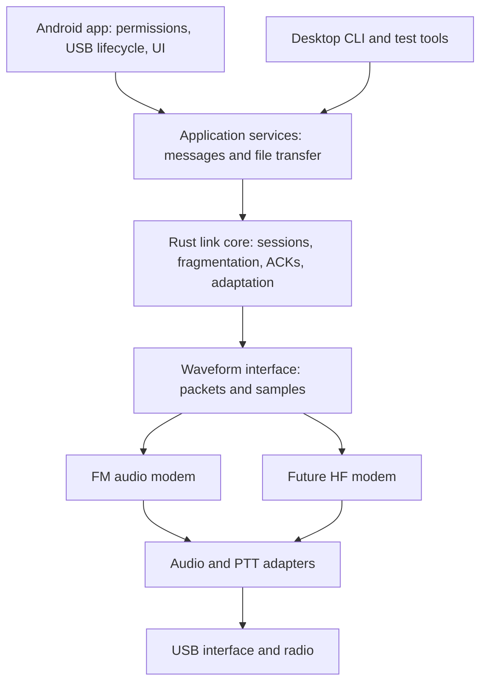

# Design notebook

Status: initial working design, 2026-09-20. The user decisions below come from
the referenced conversation **Design Open Source VARA Alternative** and this repo's
continuation. Proposals in the earlier assistant's replies remain proposals.

## Accepted direction

| Area | Direction |
| --- | --- |
| Purpose | Openly specified, cross-platform radio data; modem runs locally on a phone |
| Initial radio path | FM through ordinary radio audio interfaces |
| Reference endpoint | Samsung Galaxy S25 Ultra → Digirig Mobile → Yaesu FT-65R |
| Additional test options | User's Yaesu FTM-200D and another operator; interface details to establish |
| Language | Prefer Rust; use C/C++ where existing work materially helps |
| Development | Python experiment harness; native host tools (current host is macOS), Linux target |
| Performance | Approach VARA's practical performance initially; exceeding it is a later objective |
| Future | Xiegu X6100 on 20 m for HF; broader RF applications |

The first useful application milestone is **reliable messages and a checksummed file
between Android and a desktop through two FM stations**. This scope was suggested in
the earlier discussion and is our working milestone. It does not imply VARA wire
compatibility, Winlink gateway compatibility, or a production network stack.

## Proposed performance contract

The earlier assistant suggested 80% of VARA FM's measured payload throughput.
The user accepted the qualitative goal of getting relatively close, not that numerical
threshold. Keep **80% as a candidate criterion**, pending comparable measurements.

Compare a pinned VARA version and an unrestricted/appropriately configured baseline
on the same radio/audio path, levels, RF conditions, payloads, and retry budget. Log
the VARA license/rate configuration. Treat the modem's Narrow/Wide profile separately
from the radio's channel/deviation setting. Avoid comparing a handheld audio path
against a wider radio data connection.

Measure application payload bytes / elapsed transfer seconds, transfer completion,
short-message median and p95 latency, time to recover from loss, CPU, phone energy,
audio overruns, and occupied spectrum. Use fixed-seed incompressible bytes as well as
text. Include connection setup, turnarounds, acknowledgments, and retries. Report
strong and marginal links separately, along with trial counts and uncertainty.

There is no numeric throughput promise yet. Experiment 0001's air-time-normalized
rate is explicitly **not** this application throughput metric.

## Architecture proposal

The eventual core accepts/produces sample buffers and typed link events. It does not
own a GUI, USB permissions, wall-clock access, or sound-device discovery. Inject time
into link state machines so simulation and real hardware exercise the same behavior.
Audio callbacks should move bounded buffers; decoding and allocations run elsewhere.
Platform adapters account for device sample rate, resampling, routing, and actual
playback completion. PTT must remain asserted through waveform drain and configurable
tail time, and be released on cancellation, disconnect, and errors.

For Android, evaluate Kotlin + Oboe/AAudio + a small C ABI around Rust. CPAL is an
alternative worth a bring-up comparison. USB serial control is a separate path from
USB audio. Android/Linux are intended targets; today's successful macOS run does not
validate either. Existing KISS TNCs can provide a different packet transport but
cannot transmit an arbitrary new waveform just because a KISS API exists.

## Waveform decision remains open

| Candidate | Question to answer before adoption |
| --- | --- |
| Uncoded 2-FSK / 4-FSK | Does the harness acquire packets and expose audio/clock failure modes? Experiment 0001 only. |
| Codec2 FSK_LDPC | How much reliability/rate do an existing FEC modem and tracking receiver buy on this path? |
| Single-carrier PSK with equalization and FEC | Can we increase delivered rate through measured voice-band filtering and distortion? |
| QAM / OFDM | Does extra spectral efficiency survive clipping and available headroom after overhead? |

Simple FSK is an instrumented baseline, not a claim that it can meet the desired MVP
performance. Candidate rates must follow measured end-to-end audio response. Tone
centers alone do not establish occupied bandwidth or RF channel compatibility.

## Link protocol sketch (not a wire spec)

- A mandatory robust discovery/control mode within each supported radio profile.
- Explicit version and capability negotiation; reject unsupported major versions.
- Protected header, bounded lengths, independently checked payload blocks.
- Session identifiers and sequence numbers; suppress duplicates after lost ACKs.
- One owner of the half-duplex transmit turn; explicit transfer/recovery rules.
- First reliable prototype: bounded stop-and-wait. Evaluate selective-repeat blocks
  once correctness and measured turnaround justify the added state.
- Retry/time limits, busy-channel sensing/backoff, cancellation, and resynchronization.
- File fragmentation, reassembly limits, and final end-to-end hash verification.
- Adaptation based on recent successful delivery cost, including overhead and failures.

Do not select sequence widths, timers, FEC, addresses, or session byte layouts without
the next experiments. Callsign/application metadata and deployment-specific policy
sit above a byte transport. Security, authentication, and service-specific policy
need their own design before deployment; this experiment supplies checksums only.

## Milestones and evidence gates

1. **M0 — repeatable offline lab (implemented).** Rust TX/RX, independent Python
   vectors, randomized packet start, explicit impairments, loss curves, saved evidence.
2. **M1 — hardware characterization.** Two station paths, reproducible WAV captures,
   gain/filter/clock/turnaround measurements, Android USB audio plus PTT bring-up.
   Gate: identify devices, recover after disconnect, and release PTT reliably.
3. **M2 — candidate comparison.** Codec2 FSK_LDPC and one higher-rate candidate
   tested against the same simulations and captured channels. Gate: documented rate,
   reliability, spectrum, and target-device CPU tradeoffs; choose first PHY profile.
4. **M3 — reliable transfer.** Shared Rust session core; simulated lost/corrupt data,
   lost ACKs, duplicates, disconnects; successful message and file transfer on radios.
5. **M4 — spec v0.1.** Exact frame encoding, coding/interleaving, synchronization,
   timing/state transitions, error behavior, and independent conformance vectors.
6. **M5 — comparable VARA qualification.** Run the agreed benchmark matrix and report
   both successes and failures. Optimize later; do not redefine the target around results.

## Open decisions

| Decision | Needed evidence / next action |
| --- | --- |
| Digirig revision and Android USB route | Enumerate actual hardware; record revision, phone OS, and simultaneous audio/serial behavior |
| Second station interface | Determine available FTM-200D cable/interface or partner's setup |
| Actual FM passband, distortion, timing | Measure both directions; do not assume a 300–3000 Hz model matches either radio |
| FSK/FEC baseline dependency | Pin and benchmark Codec2 before adopting code or binary dependencies |
| Streaming timing recovery | Experiment 0002 adds bounded tracking and quantifies random-payload gains; constant runs with drift still fail |
| License | Select project/spec license before publishing; evaluate dependency licenses at pinned revisions |
| Numeric MVP acceptance | Agree thresholds after a comparable VARA baseline exists |

## Experiment 0002 update

The [streaming receiver comparison](experiments/0002-streaming-timing.md) demonstrates
longer random packets at ±2000 ppm in the synthetic AWGN channel, with a near-threshold
noise penalty. Constant runs at nonzero clock offset fail. Before extending the wire
format, compare public whitening/line coding or periodic training and an existing
FEC modem, including adversarial payloads. Preserve the fixed receiver as a reference.

The user confirmed U.S. operation with an Amateur Extra license. The
[radio testing plan](radio-testing-us.md) records the applicable code/ID distinctions
and staged bench-to-air procedure. Software publication, licensing, measured RF
spectrum, and live PTT/ID handling remain to do before an antenna-connected trial.
