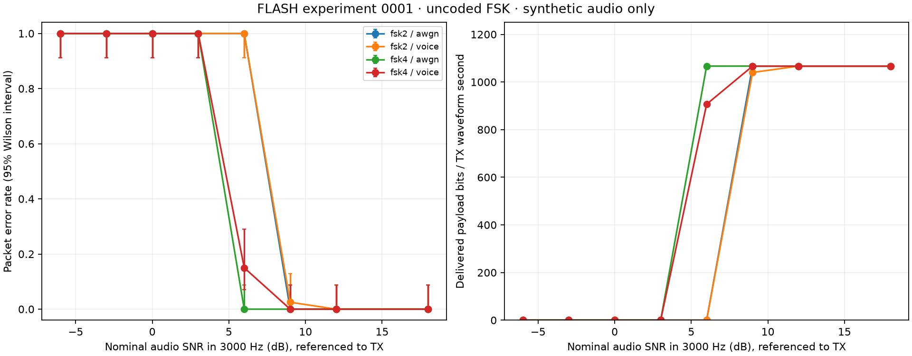

# Experiment 0001 — first results

Run: 2026-09-20 local / 2026-09-21 UTC, macOS ARM64. **Simulation evidence only.**
See the [experiment definition](0001-fsk-baseline.md) for receiver assumptions,
SNR conventions, and exact commands. No radio, phone, Codec2, or VARA was tested.

## What ran

- 1,280 packet attempts: two waveforms × two channels × eight SNRs × 40 trials.
- 280 stress attempts: two waveforms × seven conditions × 20 trials, at 18 dB.
- Fixed seed 20260920, random 256-byte payloads, unknown packet starts.
- Both waveforms: 1200 raw bit/s, 32 bytes overhead, 1.92-second TX bursts.
- Five Rust tests and eight Python tests passed in the initial run, including an
  independent Python transmitter, CRC checks, noise-only rejection, corrupted headers
  and bodies, truncation, phase/polarity/gain, and input limits. A ninth Python test
  subsequently checks the saved wire vectors; it also passes.

Python is 3.12.12; Rust is 1.93.0. Exact numerical library versions, platform,
commands, binary hashes, and source hashes are in each run's manifest. Process timing
was measured while the two sweeps ran concurrently: those timing columns are
diagnostic only and are unsuitable for comparative CPU claims.

## Noise and filtering

Counts below are successfully decoded packets, out of 40 per cell. SNR is nominal
audio SNR in 3000 Hz referenced to TX power, with noise added after any filter.

| Condition | 2-FSK | 4-FSK |
| --- | ---: | ---: |
| White noise, 3 dB | 0/40 | 0/40 |
| White noise, 6 dB | 0/40 | 40/40 |
| White noise, 9 dB | 40/40 | 40/40 |
| 300–3000 Hz synthetic filter + noise, 6 dB | 0/40 | 34/40 |
| 300–3000 Hz synthetic filter + noise, 9 dB | 39/40 | 40/40 |
| Either channel, 12 or 18 dB | 40/40 | 40/40 |

All tested points at 0 dB and below failed for both waveforms. Full data includes
every point, not just the transition region.

**Interpretation:** 4-FSK is the stronger of these two uncoded references around the
transition region. The voice filter reduces its 6 dB success count, so even a simple
filter changes the result. This does not select a production waveform, demonstrate
performance through an FT-65R, or locate an exact sensitivity threshold: the SNR grid
is coarse, sample counts are small, and the receiver searches timing hypotheses offline.

At 40/40 successes, the 95% Wilson interval still permits approximately 8.8% packet
error. At 34/40, the observed PER is 15%; the CSV carries the interval. Do not call
these conditions lossless or claim a precise 3 dB sensitivity improvement.

The maximum plotted rate is 1066.67 delivered payload bit/s per TX waveform second.
That includes framing and failed bursts, but excludes PTT, ACKs, session setup and
retries. It is not application throughput and cannot be compared directly with VARA.

## Clock mismatch and lost leading audio

Counts below are out of 20 per condition, at 18 dB with no voice filter.

| Condition | 2-FSK | 4-FSK |
| --- | ---: | ---: |
| +100 ppm | 20/20 | 20/20 |
| −100 ppm | 20/20 | 20/20 |
| +500 ppm | 0/20 | 20/20 |
| −500 ppm | 0/20 | 20/20 |
| +1000 ppm | 0/20 | 0/20 |
| First 50 ms erased | 20/20 | 20/20 |
| First 150 ms erased | 0/20 | 0/20 |

**Interpretation:** fixed symbol timing has a finite burst-length/clock-error budget.
Over a 1.92-second burst, 500 ppm corresponds to about 46 samples of timing drift:
more than a 40-sample 2-FSK symbol, but less than an 80-sample 4-FSK symbol. This is
a plausible explanation for the observed difference, not a general tolerance bound.
Longer packets should be measured before choosing a maximum frame size.

The 50 ms erasure removes part of an unused preamble. The 150 ms erasure removes the
entire sync word; failure is expected. These results do not validate a real squelch
or PTT implementation. The receiver currently uses no preamble-based acquisition.
In particular, repeating `55` in the 4-FSK mapping produces a constant 1500-Hz tone,
not a symbol-transition training sequence. A streaming design needs its own measured
training/acquisition sequence.

## Decisions supported by this run

1. Keep both profiles as regression baselines; use 4-FSK as the more promising of
   these two starting references. Do not freeze it as the mandatory connection mode.
2. Prioritize a streaming timing-recovery experiment and packet-length sweep.
   Merely finding the beginning of a packet does not solve clock drift through it.
3. Benchmark a pinned Codec2 FSK_LDPC implementation under the same conditions.
   Evaluate coding/tracking together and separately where feasible.
4. Obtain actual radio transfer functions and captures before raising symbol rates
   or selecting higher-order modulation. The synthetic voice filter is an assumption.

## Evidence files

| Run | Configuration | Summary | Per-trial outcomes |
| --- | --- | --- | --- |
| Baseline | [manifest](results/baseline/manifest.json) | [CSV](results/baseline/summary.csv) | [JSON, gzip](results/baseline/trials.json.gz) |
| Stress | [manifest](results/stress/manifest.json) | [CSV](results/stress/summary.csv) | [JSON, gzip](results/stress/trials.json.gz) |

The compressed files preserve the original per-trial JSON without changes. Rerunning
the commands writes uncompressed data under ignored `artifacts/`. Timestamps and
wall-clock timings will differ; compare success counts and source/configuration
hashes. Numerical differences near decision thresholds may occur across platforms.

Remaining qualification work: streaming receiver, FEC, realistic colored/FM noise,
frequency-error characterization, recorded-channel replay, multiple-packet handling,
real-time audio/PTT, Android/Linux operation, link reliability, occupied spectrum,
and the comparable VARA benchmark.
