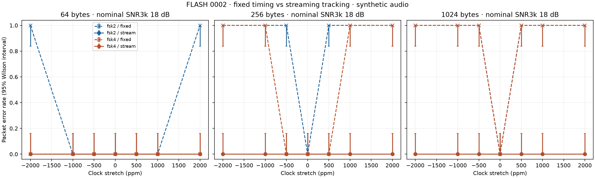
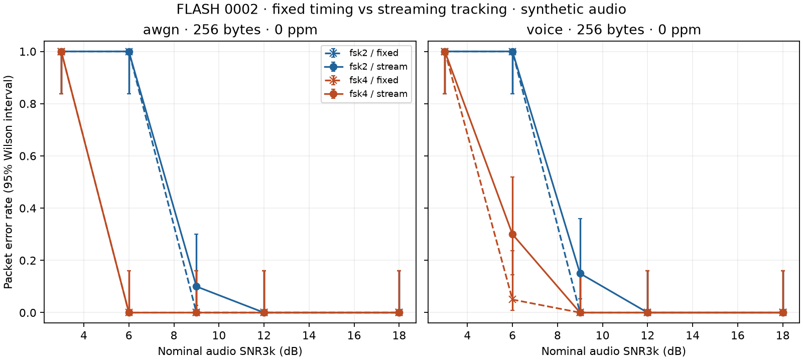

# Experiment 0002 — streaming timing recovery

Status: implemented and measured. Wire-compatible with experiment 0001. No new
over-the-air frame profile or hardware support is introduced.

## Question and implementation

Can a bounded streaming receiver recover from sample-clock mismatch without the
fixed receiver's exhaustive CRC-selected timing search? Does that change acquisition
and packet loss near the noise threshold?

The new `StreamingDecoder` consumes arbitrary f32 sample chunks and emits CRC-checked
packet events. Tone filter history, acquisition history, and one bounded packet are
retained; the full capture is not retained by the library. The CLI remains a bounded
offline capture driver and feeds 127-sample chunks by default. Neither opens devices.

The implementation retains experiment 0001's nominal one-symbol quadrature energy
filters and wire format. For each nominal integer sample phase it maintains a rolling
sync word. On an exact match it collects candidates for one symbol period and chooses
the largest sum of sync-symbol confidence `(best-second)/(best+second+1e-30)`.
It commits to that phase before checking any header/payload CRC. The constant
4-FSK preamble is still not used as a timing-training sequence.

After synchronization, a decision-directed early/late loop samples the chosen tone's
energy at ±0.2 nominal symbols around the predicted symbol start. Energy values are
linearly interpolated between sample positions. With normalized difference
`e=(late-early)/(late+early+1e-30)` and nominal samples/symbol `T`:

```text
period = clamp(period + 0.0002*T*e, 0.995*T, 1.005*T)
next_start += period + 0.08*T*e
```

The loop uses one sample of interpolation lookahead beyond the late tap. Initial
period is nominal; no clock-error value or expected payload is supplied. The ±5000 ppm
clamp is a numerical bound, not a verified capture range. Gain values are experimental.
The reported period estimate is diagnostic, not a calibrated clock measurement.

Header validation bounds packet length before accepting a body. Failure returns to
sync search. Success emits payload, consumed-sample count and loop estimate. Search
does not run concurrently while a packet is active; an overlapping packet can be
missed, especially after a valid but misleading header. Empty chunks are accepted;
nonfinite chunks fail before state changes. Recreate the decoder after a sample-stream
discontinuity; samples must otherwise be contiguous. The library may emit multiple
frames, while the CLI prints only the first valid payload.

## Reproduce

```sh
uv run --locked python -m lab.timing --trials 20 --output artifacts/timing
uv run --locked python -m lab.long_runs
```

The main run uses seed 20260921. Both receivers process **identical RX arrays** for
each trial. Source/configuration hashes, a matching source archive, per-trial records,
summaries and plots are saved in [results/timing](results/timing/manifest.json).
Use the archived Cargo manifests/toolchain and locked Python environment to reproduce
this historical run after source changes. The long-run follow-up has its own manifest
and seed. No wall-time comparison was made.

Main matrix: 1,240 distinct packet/channel trials, each passed to both receivers,
for **2,480 receiver attempts**. Clock suite: two profiles × three payload lengths
(64/256/1024) × seven clock offsets × 20 trials at 18 dB nominal audio SNR3k, AWGN only.
Noise suite: two profiles × two channels × five SNRs × 20 trials, 256-byte packets,
zero clock mismatch. Channel/SNR definitions are unchanged from experiment 0001.
Clock and voice-filter impairments have not yet been tested together in this matrix.

## Clock results

The streaming receiver decoded **20/20 in every clock-suite cell** for seeded random
payloads, including ±2000 ppm at all three tested lengths. Each 1024-byte TX burst
lasts 7.04 seconds. The corresponding fixed receiver failed most longer-packet
nonzero-offset cases. Representative results (success counts):

| Profile / bytes / offset | Fixed | Streaming |
| --- | ---: | ---: |
| 2-FSK / 256 / +500 ppm | 0/20 | 20/20 |
| 4-FSK / 256 / +1000 ppm | 0/20 | 20/20 |
| 2-FSK / 1024 / −2000 ppm | 0/20 | 20/20 |
| 4-FSK / 1024 / +2000 ppm | 0/20 | 20/20 |



This demonstrates improvement for this synthetic channel and data distribution,
not universal clock tolerance. Even 20/20 leaves an approximately 16.1% upper bound
on PER in a 95% Wilson interval for each cell. It is exploratory evidence, not a
high-reliability qualification.

## Noise tradeoff

| Profile / channel / SNR3k | Fixed | Streaming |
| --- | ---: | ---: |
| 2-FSK / AWGN / 9 dB | 20/20 | 18/20 |
| 2-FSK / voice filter / 9 dB | 20/20 | 17/20 |
| 4-FSK / AWGN / 6 dB | 20/20 | 20/20 |
| 4-FSK / voice filter / 6 dB | 19/20 | 14/20 |

All tested 12/18 dB noise-suite cells decoded 20/20 with both receivers. The fixed
receiver tries many timing phases and accepts a CRC-valid candidate; the streaming
receiver commits to one phase and makes ongoing noisy timing adjustments. It is
therefore a useful stricter baseline, not a universal improvement. The observed
near-threshold penalty warrants acquisition/loop tuning and FEC comparisons.



## Adversarial follow-up: long constant runs

Eight additional streaming attempts used 1024 bytes of all `00` or all `ff`, both
profiles, ±2000 ppm, and 18 dB nominal SNR3k. **All eight failed.** At zero clock
mismatch those patterns pass the conformance tests.

Long runs produce a single tone with little useful symbol-boundary information for
this timing detector. A plausible explanation is that timing drift accumulates until
the changing CRC symbols arrive; this receiver does not estimate rate from the tone's
frequency shift. Random test payloads concealed this weakness. This is a supported
design finding, not something to remove from the reported results.

Next experiment: an explicitly versioned public scrambler/whitener or bounded-run
line code, or periodic known training symbols. Whitening improves transition
statistics but alone cannot guarantee a worst-case run-length bound for arbitrary
inputs. Compare its overhead, adversarial cases, and recovery with a FEC/tracking
reference before choosing the production scheme. Any scrambling must be documented
and intended for signal quality; our radio test plan does not use secret keys or
concealment. See the separate [U.S. test plan](../radio-testing-us.md).

## Verification and remaining work

Seven Rust tests and thirteen Python tests pass, including sample-chunk invariance
(1/7/17/127/1024 and full-capture cases across library/CLI tests), multiple packets,
independent Python transmitters, unknown carrier phase, long random packets with
clock mismatch, ordinary constant/empty payloads, corruption rejection followed by
reacquisition, and original wire-vector conformance. Rust formatting and Clippy pass.

Internal histories are bounded by construction and checked in library tests. Output
events and packet buffers allocate; this is not an allocation-free audio callback.
There is no FEC, frequency tracking, loss-of-signal timeout, live sample-rate conversion,
or validation on Android/Linux/radios. Tail truncation can prevent the final symbol's
lookahead, so captured fixtures include trailing samples. Noise-only tests do not
establish an operational false-alarm probability.

Evidence: [manifest](results/timing/manifest.json), [CSV](results/timing/summary.csv),
[per-trial JSON/gzip](results/timing/trials.json.gz),
[matching main-run source snapshot](results/timing/source.tar.gz),
[long-run failures](results/timing/long-runs.json).
