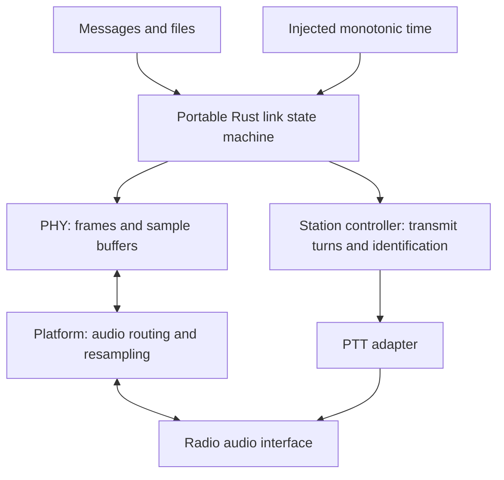

# Proposed link and platform behavior

Part of [FLASH draft 0.1](README.md). This is a behavioral design, not an implemented
link wire format or stable API. No control-message opcode, field width, timeout or
production profile is allocated here. Version-0 payload bytes remain opaque.

## Component responsibilities



The core must not discover USB devices, acquire phone permissions, operate a GUI,
or read a hidden wall clock. Adapters provide explicit sample, discontinuity, device
and completion events. A station controller coordinates identification, transmit
ownership and abort handling across data and voice playback. Audio callbacks move
bounded buffers; expensive decoding and control operations occur outside callbacks.
Queue sizes and scheduling deadlines are measured configuration choices (D06).

The intended logical boundary includes enqueue/cancel transfer, advance time, receive
samples, playback drained, transport fault and device disconnected inputs; accepted
frame/object, progress, failure and transmit/release requests are outputs. These names
describe responsibilities, not a frozen Rust/C ABI. Proposed Android bindings and
audio backends must be selected through device bring-up rather than desktop inference.

## Reliable transfer semantics

Start with **proposed bounded stop-and-wait**: one outstanding data block per live
session. Evaluate a windowed protocol only after measuring turnaround and overhead.

| Logical state | Behavior / transition |
| --- | --- |
| Idle/listening | No transfer-owned PTT assertion. Receive control traffic or accept a local transfer request. |
| Establishing | Discover a peer and agree capabilities, profile, session identity and bounded resources. Retry/expire within configured limits. |
| Sending block | Send the current block when the station controller grants a transmit turn. Complete playback and return to receive before expecting a response. |
| Waiting for acceptance | Matching session/block ACK advances; invalid, stale or unrelated responses do not. Timeout requests a bounded retry, subject to channel access. |
| Verifying object | Receiver verifies complete length/content and applies its acceptance/storage policy. It sends final confirmation only after acceptance. |
| Complete | Receiver exposes verified data; sender reports confirmed success only on matching final confirmation. |
| Cancelled/failed | Stop queued output, request PTT release, bound retained state and expose the outcome. Do not retry automatically after cancellation. |

These are logical roles; a receiver may be preparing an ACK while a sender waits.
There must be one transmit owner per endpoint, and peer turn-taking/recovery must
avoid perpetual simultaneous replies. Collision handling, busy-channel assessment,
backoff and timer constants remain D06.

ACKs must bind to session and block identity. A receiver must acknowledge an accepted
duplicate without delivering it to the application again in that live session.
An ACK for receipt of a frame is not automatically confirmation of an entire file.
Define final-confirmation retention and retry behavior so a lost final ACK can be
answered without redelivering the object. Finite retention means a sender may end
with delivery unconfirmed; a timeout cannot prove non-delivery.

Corruption, missing blocks and unsupported capabilities must not advance completion.
Retries must be bounded by attempt limits and overall deadline, with a distinct
reason for timeout, cancellation, local I/O failure and peer rejection. A local audio
fault makes the transmission outcome uncertain; release PTT and let link policy handle
recovery rather than reporting successful delivery.

File transfer adds object identity, fragmentation, bounded reassembly, total length
and final end-to-end integrity verification. Algorithms, field widths, persistence
and resume semantics remain D05. Default storage must use receiver-controlled paths;
a remote filename is metadata and must not authorize arbitrary writes or overwrites.
No promise of exactly-once delivery across crashes exists until durable identity and
retention behavior are specified and tested.

## Audio/PTT lifecycle

The intended adapter lifecycle is:

```text
receive → wait for transmit grant → prepare bounded waveform → assert PTT
        → key-up delay → play → confirm device drain → tail → release PTT
        → receiver recovery → receive
```

Every transmission must have a finite deadline established before PTT assertion.
Validation, routing and sufficient buffering precede assertion. Playback submission
is not playback completion: wait for the device/backend's drain event before normal
release. On cancellation, timeout, underflow or device failure, stop/discard queued
audio as appropriate, attempt immediate release and report the uncertain outcome.
If release cannot be confirmed, report the fault; do not synthesize confirmation.
Host crash/unplug behavior needs physical testing and may require hardware protection.

Identity/device changes must invalidate stale routing. Reconnection must not replay a
previously cancelled or failed transmit request implicitly. A sample discontinuity
must reset or explicitly resynchronize affected PHY state. Resampling must account for
actual device rate; claiming 48 kHz in metadata does not measure oscillator accuracy.

Identification scheduling must reserve airtime between bounded bursts and remain
available when packet reception fails. Station policy may defer or terminate data
to meet an identification or operator-control deadline. Identification content is
not a version-0 frame and an embedded callsign is not treated as its substitute.

For Digirig Mobile, the current desktop path uses explicit USB audio plus serial RTS.
Exact port names are local configuration, not protocol constants. The frequency
argument in the test adapter is metadata only and does not tune/read back the radio.
The eight-second clip limit and software cleanup tests are useful current safeguards,
but do not satisfy the entire lifecycle above. See [bring-up evidence](../desktop-radio-bringup.md).
